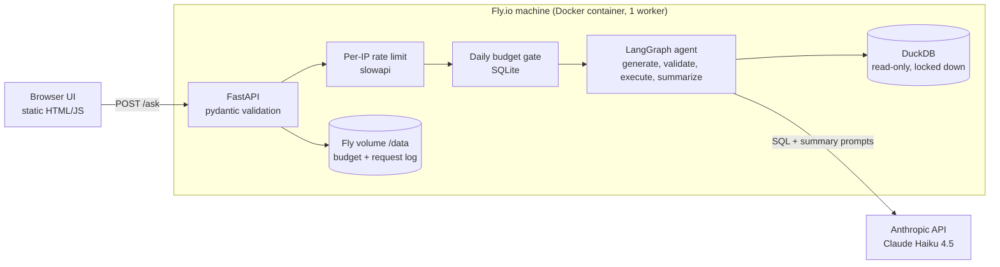

# Ask the Bike Data

**Live demo: https://text-to-sql-agent.fly.dev** (the machine sleeps when idle, so the first request can take a few seconds)

A text-to-SQL agent: ask a question in plain English about a (synthetic) Citi Bike-shaped
dataset, and get back the SQL, the result table, and a short written answer. The page shows each
step (write, check, run, explain), including when a query is blocked.

Built with **LangGraph + Claude + DuckDB**, with a hand-built SQL security layer, an eval suite with a
held-out test set, per-request cost controls, and a containerised deploy on **Fly.io**.

**What this project is about:** an LLM that writes SQL for the public internet has to be treated as an
untrusted component. The interesting parts are the guard that checks its output, the limits that keep one
visitor from draining the budget, and the eval that measures whether it is right.


## Quickstart

```bash
python3 -m venv .venv && source .venv/bin/activate
pip install -r requirements.txt
cp .env.example .env            # then put your ANTHROPIC_API_KEY in it
python -m data.generate         # builds data/bike.duckdb (seeded, reproducible)
python -m app.cli --demo        # 5 starter questions
python -m app.cli "Which borough has the most trips?"
uvicorn app.main:app --reload   # the web UI on http://localhost:8000/ and the API docs on /docs
pytest                          # the test suite (no API key or network needed)
```

## Architecture



A request is rejected as early as possible: bad input at validation, too-frequent callers at the rate limit,
an exhausted day at the budget gate, and only then does anything cost money.

## How the agent works


| Node | What it does |
|---|---|
| `generate_sql` | Schema (read live from DuckDB) + question -> Claude writes one DuckDB query. On a retry it also sees its failed SQL and the DB error |
| `validate_sql` | Parses the SQL with `sqlglot` and enforces the policy below |
| `refuse` | Policy violations get a refusal, never a retry |
| `execute_sql` | Runs on a read-only connection with a 10s timeout and a 200-row cap |
| `summarize` | Claude turns the result rows into a 1-3 sentence answer |

Two failures, two treatments: a **policy violation** is refused (retrying would only coach the model
to probe the guard); an **execution error** (e.g. a wrong column name) gets one retry with the error message.

## Security: three independent layers

1. **Prompt:** the model is told to write one read-only query, with an `unanswerable` escape hatch. A request, not a control.
2. **`sql_guard.py`:** parses the SQL into an AST. Exactly one statement, SELECT only, table allowlist
   (blocks `read_csv(...)`, `FROM '/etc/passwd'`, `information_schema`), allowlist for unrecognised functions
   (blocks `getenv`, `current_setting`). The re-rendered SQL is what runs, so what is validated is what executes.
3. **`db.py`:** DuckDB opened `read_only`, `enable_external_access=false`, configuration locked, memory capped.
   Tested on its own: with the guard bypassed, DuckDB still refuses writes, file reads and `SET` overrides.

`pytest` runs 160+ tests covering all of the above, including attack strings, plus the graph routing with a scripted fake LLM.

## API and cost controls

`POST /ask {"question": "..."}` returns the answer, the SQL, the result rows, latency and token counts.
`GET /status` says whether the demo still has budget today; `GET /health` is for the platform health check.

This endpoint spends real money per call, so it is protected in layers:

| Control | Where | Behaviour |
|---|---|---|
| Input limits | pydantic | 3-300 characters; anything else is a 422 before any model call |
| Rate limit | `slowapi`, per client IP | 5/minute and 60/day (configurable); 429 beyond that |
| Daily budget | `app/budget.py` (SQLite) | Default $0.50/day, survives restarts; 503 "resting" when spent |
| Provider limits | Anthropic SDK retries + error mapping | 429/5xx from Anthropic are retried with backoff (3x), then returned as a clean 503 + `Retry-After` |
| Error hygiene | `main.py` | Clients get a generic message; the real exception name goes to the log |
| Observability | `app/telemetry.py` | A callback counts tokens per request; one JSON line per request (latency, tokens, cost, SQL) in `state/requests.jsonl`. IPs are hashed |

Cost is computed from the published per-token prices (Haiku 4.5: $1 in / $5 out per million tokens).
A first live measurement: one typical question used 676 input and 86 output tokens, about $0.0011.
A proper average will come from the eval run.

## Web UI

One static page (`ui/`) served by the same FastAPI process, so there is a single container to run.
Everything the model or database returns is inserted with `textContent`, never as HTML, and the page is
served with a strict Content-Security-Policy (`script-src 'self'`, no inline scripts or styles), so a hostile
question or a hostile query result cannot inject markup. A test fails if inline script, inline style or
event-handler attributes appear in the HTML. The UI also shows the "resting" state when the daily budget is spent
and clear messages for rate limits and upstream errors.

## Deployment

The app ships as one Docker image (`Dockerfile`) and runs on Fly.io (`fly.toml`).

- **Image:** `python:3.12-slim`, dependencies installed before the code so rebuilds stay fast. The synthetic
  database is generated during the build from the seeded generator, so the data never lives in git and every
  build is identical.
- **One worker, on purpose:** rate-limit counters are in memory, so a second worker would double every client's allowance.
- **State:** the request log and the budget database live on a Fly volume mounted at `/data`. The container's
  own disk is discarded on each deploy; the volume is not.
- **Secrets:** the Anthropic key is a Fly secret (`fly secrets`), never in the image, the repo or `fly.toml`.
  `.dockerignore` also keeps `.env` out of the build upload.
- **Client IP:** behind Fly's proxy the app reads the `Fly-Client-IP` header for rate limiting, and only when
  `FLY_APP_NAME` is set, so the header cannot be forged when running anywhere else.
- **Idle cost:** the machine stops when idle and starts on the next request (`auto_stop_machines`).
  On Fly's published prices at the time of writing, a 1 GB shared-CPU machine is $6.70/month if it ran all the time,
  plus $0.15/month for a 1 GB volume, so an idle demo costs well under that.
- **Isolation:** Fly runs each machine in a Firecracker micro-VM, in addition to the container boundary.

```bash
fly apps create <name>
fly volumes create bike_state --size 1 --region <region-in-fly.toml>
grep '^ANTHROPIC_API_KEY=' .env | fly secrets import
fly deploy --ha=false      # one machine, because the volume attaches to one machine
```

## Data

Synthetic, seeded (`SEED=42`), ~160k trips across 62 stations for 2025. Schema mirrors the
real Citi Bike export. Planted patterns: members commute, casuals ride midday/weekends,
rain hits casual riders hardest, electric bikes are faster. **This is synthetic data, not real ridership.**

## Roadmap

- [x] Weekend 1: synthetic data + LangGraph baseline
- [x] Weekend 2 (part 1): sqlglot guard, DuckDB lockdown, retry loop, tests
- [x] Weekend 2 (part 2): FastAPI endpoint, per-IP rate limit, daily budget cap, token/cost logging
- [x] Weekend 3 (part 1): 30-question eval set, grader, metrics, Haiku vs Sonnet baseline
- [x] Weekend 3 (part 2): one evidence-based prompt change, measured before/after
- [x] Weekend 4 (part 1): web UI, Docker image, Fly.io deploy with volume and secret
- [ ] Weekend 4 (part 2): screenshots and a LangSmith trace of one request

## Evaluation

30 questions with known-correct answers (`evals/questions.yaml`): lookups, dates, joins, weather joins,
statistics, plus questions the data cannot answer and attack prompts. Each question has a gold SQL query.

- **Graded by result, not by SQL text.** Both queries are run and their results compared (`evals/compare.py`):
  integers must match exactly, decimals within rounding, column names/order and extra columns are ignored,
  row order matters only for rankings. The grader has its own tests.
- **Dev / test split.** 18 dev questions are for learning from failures; 12 test questions are held out.
  Test failures are never printed while tuning, so the test score stays honest.
- **Every run is saved** with per-question SQL, latency, tokens and cost (`evals/results/`).

Reproduce: `python -m evals.run_eval --label mine` (about $0.04 on Haiku, $0.11 on Sonnet).

### Baseline results (first prompt, before any tuning)

| Model | Runs | Accuracy (30 questions) | Latency p50 / p95 | Cost per question |
|---|---|---|---|---|
| Claude Haiku 4.5 (temperature 0) | 2 | 28/30 (93%) both runs | 1.7s / 2.1s | $0.0012 |
| Claude Sonnet 5.5 (default temperature) | 3 | 30/30 (100%) all three runs | 2.8-3.0s / 4.6-7.4s | $0.0037 |

How to read this honestly:
- Sonnet costs about **3x more** and is about **1.7x slower** for **2 more correct answers out of 30**.
  With 30 questions that is a small, suggestive difference, not a statistically strong one.
- Sonnet 5.5 rejects `temperature=0`, so it cannot be made deterministic; that is why it was run 3 times.
- The eval is near its ceiling for strong models on this small, simple schema; it would need harder
  questions to separate them further. p95 over 30 requests is effectively the second-slowest request.
- Haiku's one visible failure: asked for weekend trips, it wrote `DAYOFWEEK(...) IN (6, 7)` assuming ISO
  numbering. DuckDB numbers Sunday=0 .. Saturday=6, so it silently counted only Saturdays (23,057 instead of
  44,718). The query ran without error and returned a plausible number, which is why text-to-SQL needs an eval.

### After one prompt change

The only change (prompt `491c9d99` -> `ef27638f`) is one factual line added to `app/prompts.py`:

```diff
+ - Weekday numbering in DuckDB: dayofweek(d) is 0 for Sunday through 6 for Saturday; isodow(d) is 1 for Monday
+   through 7 for Sunday. So weekend days are dayofweek(d) IN (0, 6), equivalently isodow(d) IN (6, 7).
```

It came from reading one **dev** failure (the weekend-trips question above). The held-out test set was run once, after the change.

| Model | Dev (18 q), before -> after | Test (12 q), before -> after | All 30, before -> after |
|---|---|---|---|
| Claude Haiku 4.5 | 17/18 -> **18/18** | 11/12 -> 11/12 | 28/30 -> **29/30** |
| Claude Sonnet 5.5 | 18/18 -> 18/18 | 12/12 -> 12/12 | 30/30 -> 30/30 (1 run) |

What this does and does not show:
- The fix works on the question it was written for, and the held-out set did not get worse. That is all.
  The change is unrelated to the one held-out question Haiku still misses, so no test improvement was expected.
- **Known weakness:** Haiku answers one held-out question it should have declined as unanswerable.
  Its details were deliberately not inspected, to keep the test set clean. Tuning against it would turn the test
  set into a dev set, so the next round of prompt work needs new held-out questions.
- Sixteen of the 18 dev questions and 11 of the 12 test questions were already passing, so there was little room to
  improve. These are small sets: one question is worth 3-8 percentage points.

## Limits and what I would do next

- **Synthetic data.** The trips are generated, so the answers describe the generator, not New York. The schema
  matches the real export, so swapping in real data is a data-loading change.
- **Small eval.** 30 questions on a three-table schema. Strong models are near the ceiling, and one question moves the
  score by 3-8 points. The next step would be more and harder questions, including new held-out ones.
- **No retrieval or vector search.** The schema is small enough to put in the prompt, so none was needed.
  A schema with hundreds of tables would need schema retrieval.
- **Container runs as root.** The SQL guard, the locked-down DuckDB connection and Fly's micro-VM isolation still apply, but a
  non-root user is the standard hardening step I have not done.
- **One machine, one volume.** There is no redundancy: a lost volume resets the budget counter and the request log, which
  is acceptable for a demo but not for production. Rate limits are per machine.
- **Prompt-injection risk is bounded, not removed.** The model can still be talked into answering oddly. What it cannot do
  is run anything except a validated read-only query on a locked-down database.
- **Tracing is optional.** LangSmith tracing can be turned on with the environment variables in `.env.example`; no trace
  data is committed here.
