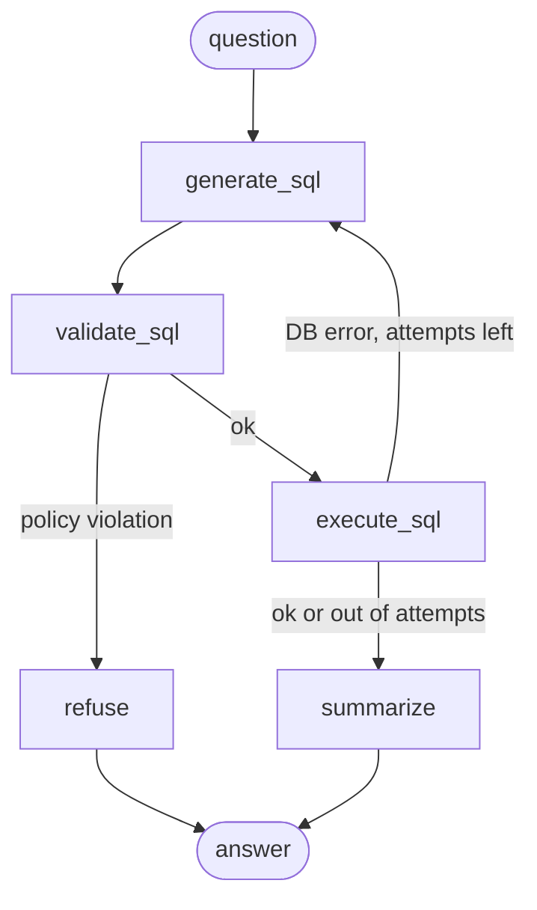

# Ask the Bike Data

A text-to-SQL agent: ask a question in plain English about a (synthetic) Citi Bike-shaped
dataset, and get back the SQL, the result table, and a short written answer.

Built with **LangGraph + Claude + DuckDB**, with a custom SQL security layer and eval suite
(in progress — see roadmap).

## Quickstart

```bash
python3 -m venv .venv && source .venv/bin/activate
pip install -r requirements.txt
cp .env.example .env            # then put your ANTHROPIC_API_KEY in it
python -m data.generate         # builds data/bike.duckdb (seeded, reproducible)
python -m app.cli --demo        # 5 starter questions
python -m app.cli "Which borough has the most trips?"
uvicorn app.main:app --reload   # the HTTP API on http://localhost:8000/docs
```

## How it works



| Node | What it does |
|---|---|
| `generate_sql` | Schema (read live from DuckDB) + question -> Claude writes one DuckDB query. On a retry it also sees its failed SQL and the DB error |
| `validate_sql` | Parses the SQL with `sqlglot` and enforces the policy below |
| `refuse` | Policy violations get a refusal, never a retry |
| `execute_sql` | Runs on a read-only connection with a 10s timeout and a 200-row cap |
| `summarize` | Claude turns the result rows into a 1-3 sentence answer |

Two failures, two treatments: a **policy violation** is refused (retrying would only coach the model
to probe the guard); an **execution error** (e.g. a wrong column name) gets one retry with the error message.

## Security: three independent layers

1. **Prompt:** the model is told to write one read-only query, with an `unanswerable` escape hatch. A request, not a control.
2. **`sql_guard.py`:** parses the SQL into an AST. Exactly one statement, SELECT only, table allowlist
   (blocks `read_csv(...)`, `FROM '/etc/passwd'`, `information_schema`), allowlist for unrecognised functions
   (blocks `getenv`, `current_setting`). The re-rendered SQL is what runs, so what is validated is what executes.
3. **`db.py`:** DuckDB opened `read_only`, `enable_external_access=false`, configuration locked, memory capped.
   Tested on its own: with the guard bypassed, DuckDB still refuses writes, file reads and `SET` overrides.

`pytest` runs 100+ tests covering all of the above, including attack strings, plus the graph routing with a scripted fake LLM.

## API and cost controls

`POST /ask {"question": "..."}` returns the answer, the SQL, the result rows, latency and token counts.
`GET /status` says whether the demo still has budget today; `GET /health` is for the platform health check.

This endpoint spends real money per call, so it is protected in layers:

| Control | Where | Behaviour |
|---|---|---|
| Input limits | pydantic | 3-300 characters; anything else is a 422 before any model call |
| Rate limit | `slowapi`, per client IP | 5/minute and 60/day (configurable); 429 beyond that |
| Daily budget | `app/budget.py` (SQLite) | Default $0.50/day, survives restarts; 503 "resting" when spent |
| Provider limits | Anthropic SDK retries + error mapping | 429/5xx from Anthropic are retried with backoff (3x), then returned as a clean 503 + `Retry-After` |
| Error hygiene | `main.py` | Clients get a generic message; the real exception name goes to the log |
| Observability | `app/telemetry.py` | A callback counts tokens per request; one JSON line per request (latency, tokens, cost, SQL) in `state/requests.jsonl`. IPs are hashed |

Cost is computed from the published per-token prices (Haiku 4.5: $1 in / $5 out per million tokens).
A first live measurement: one typical question used 676 input and 86 output tokens, about $0.0011.
A proper average will come from the eval run.

## Data

Synthetic, seeded (`SEED=42`), ~160k trips across 62 stations for 2025. Schema mirrors the
real Citi Bike export. Planted patterns: members commute, casuals ride midday/weekends,
rain hits casual riders hardest, electric bikes are faster. **This is synthetic data, not real ridership.**

## Roadmap

- [x] Weekend 1: synthetic data + LangGraph baseline
- [x] Weekend 2 (part 1): sqlglot guard, DuckDB lockdown, retry loop, tests
- [x] Weekend 2 (part 2): FastAPI endpoint, per-IP rate limit, daily budget cap, token/cost logging
- [x] Weekend 3 (part 1): 30-question eval set, grader, metrics, Haiku vs Sonnet baseline
- [ ] Weekend 3 (part 2): one evidence-based prompt change, measured before/after
- [ ] Weekend 4: Docker, Fly.io deploy, UI, architecture diagram, LangSmith trace

## Evaluation

30 questions with known-correct answers (`evals/questions.yaml`): lookups, dates, joins, weather joins,
statistics, plus questions the data cannot answer and attack prompts. Each question has a gold SQL query.

- **Graded by result, not by SQL text.** Both queries are run and their results compared (`evals/compare.py`):
  integers must match exactly, decimals within rounding, column names/order and extra columns are ignored,
  row order matters only for rankings. The grader has its own tests.
- **Dev / test split.** 18 dev questions are for learning from failures; 12 test questions are held out.
  Test failures are never printed while tuning, so the test score stays honest.
- **Every run is saved** with per-question SQL, latency, tokens and cost (`evals/results/`).

Reproduce: `python -m evals.run_eval --label mine` (about $0.04 on Haiku, $0.11 on Sonnet).

### Baseline results (first prompt, before any tuning)

| Model | Runs | Accuracy (30 questions) | Latency p50 / p95 | Cost per question |
|---|---|---|---|---|
| Claude Haiku 4.5 (temperature 0) | 2 | 28/30 (93%) both runs | 1.7s / 2.1s | $0.0012 |
| Claude Sonnet 5.5 (default temperature) | 3 | 30/30 (100%) all three runs | 2.8-3.0s / 4.6-7.4s | $0.0037 |

How to read this honestly:
- Sonnet costs about **3x more** and is about **1.7x slower** for **2 more correct answers out of 30**.
  With 30 questions that is a small, suggestive difference, not a statistically strong one.
- Sonnet 5.5 rejects `temperature=0`, so it cannot be made deterministic; that is why it was run 3 times.
- The eval is near its ceiling for strong models on this small, simple schema; it would need harder
  questions to separate them further. p95 over 30 requests is effectively the second-slowest request.
- Haiku's one visible failure: asked for weekend trips, it wrote `DAYOFWEEK(...) IN (6, 7)` assuming ISO
  numbering. DuckDB numbers Sunday=0 .. Saturday=6, so it silently counted only Saturdays (23,057 instead of
  44,718). The query ran without error and returned a plausible number, which is why text-to-SQL needs an eval.

